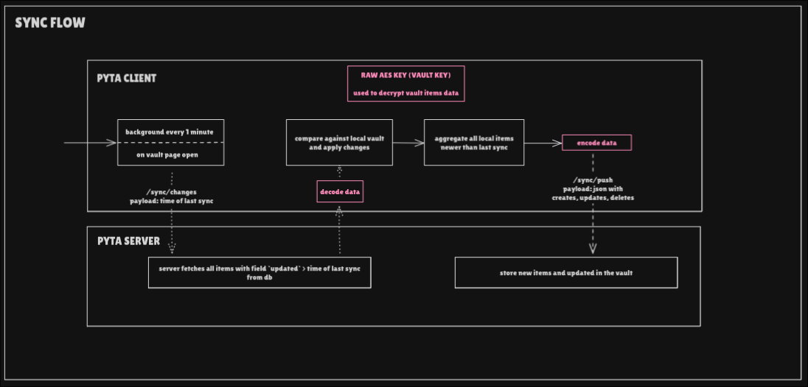

# Sync API (`/sync`)

All sync endpoints are grouped under the `/sync` prefix.

Sync is used to synchronize encrypted credential storage between the client and server.



---

## GET `/sync/changes`

Retrieve changes from the server since a specific cursor or timestamp.

### Request

**Query Parameters**

- `cursor` (optional): Resume from a specific point
- `since` (optional): ISO timestamp to fetch changes after

### Response

**Status:** `200 OK`

**Body**

```json
{
  "changes": [
    {
      "id": "uuid",
      "username_data": "bytes",
      "password_data": "bytes",
      "domains": ["bytes"],
      "notes": "bytes",
      "created_at": "2026-01-01T00:00:00",
      "updated": "2026-01-01T00:00:00",
      "deleted_at": null
    }
  ],
  "next_cursor": "string",
  "has_more": false
}
```

### Behavior

* Returns all storage changes since the given cursor or timestamp
* Includes created, updated, and deleted items
* Supports pagination via cursor
* Requires authentication (session cookie)

---

## POST `/sync/push`

Push local changes to the server (creates, updates, deletes).

### Request

**Body**

```json
{
  "creates": [
    {
      "id": "uuid",
      "username_data": "bytes",
      "password_data": "bytes",
      "domains": ["bytes"],
      "notes": "bytes",
      "updated": "2026-01-01T00:00:00"
    }
  ],
  "updates": [
    {
      "id": "uuid",
      "username_data": "bytes",
      "password_data": "bytes",
      "domains": ["bytes"],
      "notes": "bytes",
      "updated": "2026-01-01T00:00:00"
    }
  ],
  "deletes": [
    {
      "id": "uuid",
      "updated": "2026-01-01T00:00:00"
    }
  ]
}
```

### Response

**Status:** `200 OK`

**Body**

```json
{
  "success_count": 5,
  "conflict_count": 1,
  "conflicts": [
    {
      "id": "uuid",
      "reason": "server_updated_after_client"
    }
  ]
}
```

### Behavior

* Processes creates, updates, and deletes in a single request
* Detects conflicts using timestamps
* Returns conflict information for client resolution
* All data is encrypted client-side before transmission
* Requires authentication (session cookie)

### Errors

| Status | Reason                    |
| ------ | ------------------------- |
| 401    | Not authenticated         |
| 409    | Conflict (see conflicts)  |

---

## Notes

* All credential data is encrypted on the client before sync
* The server stores only encrypted blobs
* Conflicts are resolved by timestamp comparison
* Multiple devices can sync to the same account
